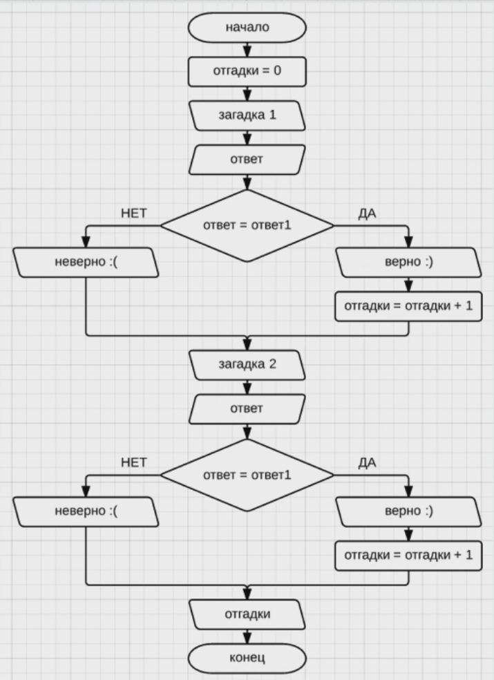
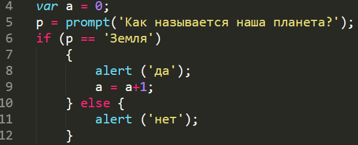
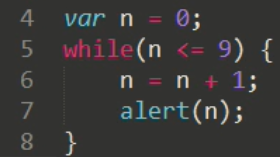
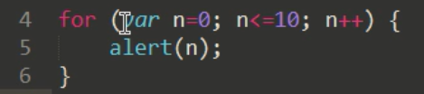
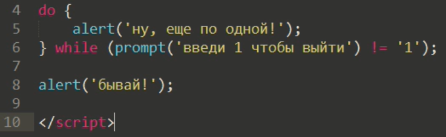
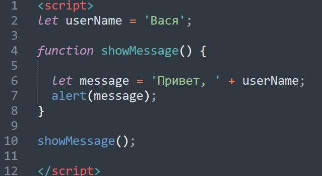
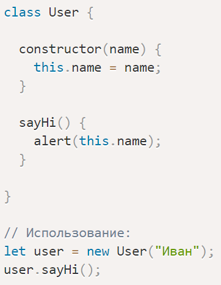
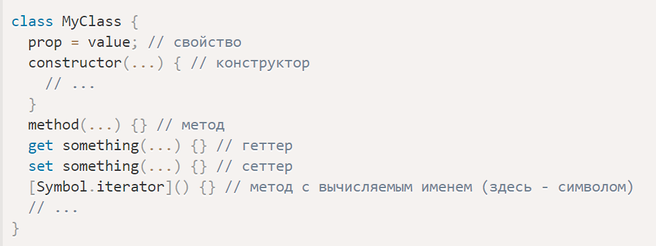

# WEB-development

## Практика студентов Финансового университета

# javaScript
__________________________________________

- # Java Script. Переменные, типы данных

### [Методичка](https://docs.google.com/document/d/16WPr1DUWe6Bp80j_AT6WMD0nRo2yIQ7t/edit)

Цель работы

    Получить навыки работы с переменными, различными типами данных, операциями над ними.

### Задания для выполнения

Попросите пользователя ввести любое число и сохраните его в переменную.

Создайте калькулятор, который будет выполнять все арифметические операции над любыми введенными пользователем двумя числами.

Необходимо попросить  пользователя задумать число. Затем он должен  умножить это число  на 2 и прибавить к полученному результату 7. То, что вышло в итоге, нужно ввести в диалоговом окне prompt(). Вы должны выдать пользователю, какое число он задумал.

С помощью метода prompt() получите сначала имя пользователя, затем год его рождения и сохраните в 2 переменные. Вычислите возраст пользователя, и выведите его в абзаце с помощью document.write() в таком формате "Антон: 24".

Сохраните калькулятор и отправьте на GitHub в репозиторий Student, используя формат в названии Фамилия(латинскими буквами)_1.

### Методические указания

Для запоминания числа можно использовать команду prompt:

Чтобы запустить файл, необходимо запустить его в Google Chrome.

Проверить наличие ошибок можно с помощью нажатия трех точек в верхнем правом углу, затем – Дополнительные инструменты – Инструменты разработчика. В подсказке выдается номер строки, где содержится ошибка.

Вывести на экран значение переменной можно таким образом:

Для перевода в целочисленный тип из строки можно воспользоваться функцией parseInt.

### Контрольные вопросы
В чем разница между var и let?

Какие типы данных в Java Script вы знаете?

В каком типе сохраняется переменная, полученная с помощью команды prompt?

### Дополнительные задания

Выведите на экран тип используемой переменной.

 

### Дополнительные материалы
https://html-plus.in.ua/javascript-simple-tasks/

__________________________________________

 - # Java Script. Оператор ветвления if, циклы do, while, for

### [Методичка](https://docs.google.com/document/d/1Y4N8oo9pN6-yvNcrUwUgOcoTt3sIajDo/edit)

Цель работы

    Получить навыки работы с циклами и научиться создавать проверку условий средствами Java Script.

## Задания для выполнения

Реализовать представленную блок-схему посредством JavaScript

 

Напишите программу на Java Script, которая считает от 1 до 10.

Создайте программу для застолий, которая будет предлагать «Еще по одной?» пока пользователь не введет единицу.

Вычислите факториал числа (вашего порядкового номера в журнале).

Напишите программу, которая проверяет вашу фамилию на палиндром.

Выведите все простые числа от 1 до вашего порядкового номера в журнале. 

Загрузите три полученные программы на GitHub в репозиторий Student, используя формат в названии Фамилия(латинскими буквами)_2.

## Методические указания

Чтобы создать проверку условия, можно воспользоваться оператором if. Синтаксис:

 

Для подсчета чисел от 1 до 10 можно воспользоваться циклом While:

 

Или цикл For:

 

Для реализации программы «Застолье» можно воспользоваться циклом do:

 

## Контрольные вопросы
Какие условия могут проверяться оператором if?

В чем отличие циклов while, do, for?

## Дополнительные задания

Написать программу «Угадай число»: компьютер загадывает произвольное число и если пользователь угадывает его, компьютер сообщает об этом и выходит из цикла. 

- # Java Script. Массивы

Цель работы

    Получить навыки работы с массивами и функциями.

## Задания для выполнения

 Сформировать массив из 15 целых чисел, выбранных случайным образом из интервала [-10, 30]. 
 Найти среднее арифметическое положительных элементов.

Заменить отрицательные элементы в числовом массиве из n чисел (n>10) их квадратами, оставив остальные без изменения.

В заданном массиве найти среднее арифметическое положительных чисел, среднее арифметическое отрицательных чисел и число нулей.

Организовать симулятор, который выдает только три случайных значения – красный, черный и белый (0, 1, 2). Запустить симуляцию 1000 000 раз. Узнать, какое максимальное число раз выпадало красное значение.

## Методические указания

Для задания массива достаточно задать: 

    var arr = [];

Для формирования случайного значения можно использовать функцию:

    arr.push(Math.round(Math.random()*2))

Для обращения к элементам массива можно использовать цикл: 

    for(i=0; i<=1000000; i++) {
    arr[i] = Math.round(Math.random()*2);
    }

## Контрольные вопросы

Какие значения могут принимать элементы массива?

## Дополнительные задания
Организовать симулятор, который выдает только три случайных значения – красный, черный и белый (0, 1, 2). 

Запустить симуляцию 1000 000 раз. Узнать, какая последовательность из красных, черных или белых значений была самой длинной.

- # Методы объекта, this. Конструкторы, создание объектов через "new"

Цель работы

    Получить навыки работы с объектами JS.

## Задания для выполнения

Скопируйте код объекта и проанализируйте его работу:

    let user = {
    name: "Джон",
    age: 30
    };

Добавим метод для объекта

    user.sayHi = function() {
    alert("Привет!");
    };

    user.sayHi(); // Привет!
 
 
 Создайте объект – информация о покупателе (не менее 5 строк) и выведите три из них.

Создайте объекты пользователи, заказы и рестораны с соответствующими значениями.

Организуйте вывод информации из объектов по условию.

При помощи функции-конструктора и оператора "new" создайте функцию, выводящую имена вашей группы:

    function User(name) {
    this.name = name;
    this.isAdmin = false;
    }

    let user = new User("Вася");

    alert(user.name); // Вася
    alert(user.isAdmin); // false

Используя конструктор, создайте объект – студент. 

Передайте конструктору параметры, определяющие, как создавать объект, и что в него записывать:

    function User(name) {
    this.name = name;

    this.sayHi = function() {
        alert( "Меня зовут: " + this.name );
    };
    }

    let vasya = new User("Вася");

    vasya.sayHi(); // Меня зовут: Вася

    /*
    vasya = {
    name: "Вася",
    sayHi: function() { ... }
    }
    */

## Методические указания

Для задания метода:

    // эти объекты делают одно и то же (одинаковые методы)

    user = {
    sayHi: function() {
        alert("Привет");
    }
    };

    // сокращённая запись выглядит лучше, не так ли?
    user = {
    sayHi() { // то же самое, что и "sayHi: function()"
        alert("Привет");
    }
    };

Для доступа к информации внутри объекта метод может использовать ключевое слово this.

    let user = {
    name: "Джон",
    age: 30,

    sayHi() {
        // this - это "текущий объект"
        alert(this.name);
    }

    };

    user.sayHi(); // Джон

## Контрольные вопросы

Для чего нужен объект?

Какие методы могут быть у объекта?

## Дополнительные задания

Создайте объект Калькулятор, в котором будут реализованы арифметические операции в качестве значений.

## Дополнительные материалы
https://learn.javascript.ru/object-methods

https://learn.javascript.ru/constructor-new

- # Java Script. Классы и функции

### [Методичка](https://docs.google.com/document/d/1mSKPwWwz5djLlKDkeLyjyHs0vNasXjSR/edit)

Цель работы

    Получить навыки работы с классами и функциями.

## Задания для выполнения

Скопируйте код и проанализируйте его работу:

    function showMessage() {
    let message = "Привет, я JavaScript!"; // локальная переменная

    alert( message );
    }

    showMessage(); // Привет, я JavaScript!

    alert( message ); // 
 
 Напишите функцию JavaScript, которая проверяет, является ли переданная строка палиндромом или нет (код из прошлой практической работы)?

Заменить отрицательные элементы в числовом массиве из n чисел (n>10) их квадратами, оставив остальные без изменения (код из прошлой практической работы).

Создайте класс, который будет сохранять в переменную имя пользователя и выводить его на экран. Используйте его.
Перепишите код с использованием синтаксиса класса:

 

Создайте класс, который переворачивает ваше имя.

Загрузить созданные программы на GitHub в репозиторий Student, используя формат в названии Фамилия(латинскими буквами)_4.

## Методические указания

Для задания и вызова класса можно использовать синтаксис:

 

Базовый синтаксис для классов выглядит так:

 

## Контрольные вопросы

Для чего нужен класс?

Как доказать, что класс в JS – это функция?

## Дополнительные задания

Организовать в виде класса и функции симулятор, который выдает только три случайных значения – красный, черный и белый (0, 1, 2). Запустить симуляцию 1000 000 раз. 

Узнать, какая последовательность из красных, черных или белых значений была самой длинной.

## Дополнительные материалы

https://learn.javascript.ru/function-basics

https://learn.javascript.ru/class

https://habr.com/ru/post/518386/

- # Java Script. Стрелочные функции

Цель работы

    Получить навыки работы со стрелочными функциями JS.

## Задания для выполнения

Воспользовавшись методическим указанием реализуйте Калькулятор в виде стрелочных функций.

Используя  Function Expression реализуйте проверку условий тестовых заданий.

Реализуйте в виде стрелочной функции функцию, проверяющую вашу фамилию на полиндром.

Реализуйте в виде стрелочной функции вычисление среднего значения данных в массиве

В виде стрелочной функции реализуйте функцию, вычисляющую количество дней до нового года.

Создайте пустую стрелочную функцию возвращает undefined

Создайте массив и напишите стрелочные функции для него: суммирование всех элементов, выявить все четные, умножить каждый элемент на 2. 

Создайте массив с e-mail. Организуйте фильтр на странице html по названию почты.

Загрузить созданные программы на GitHub в репозиторий Student, используя формат в названии Фамилия(латинскими буквами)_4.

## Методические указания

Эти записи равносильны

    let func = (arg1, arg2, ...argN) => expression

    let func = function(arg1, arg2, ...argN) {
    return expression;
    };

Пример  Function Expression

    let age = prompt("Сколько Вам лет?", 18);

    let welcome = (age < 18) ?
    () => alert('Привет') :
    () => alert("Здравствуйте!");

    welcome(); // теперь всё в порядке

Стрелочная функция может быть многослойной

    let sum = (a, b) => {  // фигурная скобка, открывающая тело многострочной функции
    let result = a + b;
    return result; // при фигурных скобках для возврата значения нужно явно вызвать return
    };
    alert( sum(1, 2) ); // 3

Базовый синтаксис

    (param1, param2, …, paramN) => { statements }
    (param1, param2, …, paramN) => expression
    // эквивалентно: (param1, param2, …, paramN) => { return expression; }

// Круглые скобки не обязательны для единственного параметра:

    (singleParam) => { statements }
    singleParam => { statements }

// Функция без параметров нуждается в круглых скобках:

    () => { statements }
    () => expression 
    // Эквивалентно: () => { return expression; }

// Пустая стрелочная функция возвращает undefined

    let empty = () => {};
    (() => 'foobar')(); 

// Удобные операции над массивами: filter, map, ...

    var arr = [5, 6, 13, 0, 1, 18, 23];

    var sum = arr.reduce((a, b) => a + b);  
    // 66

    var even = arr.filter(v => v % 2 == 0); 
    // [6, 0, 18]

    var double = arr.map(v => v * 2);       
    // [10, 12, 26, 0, 2, 36, 46]

## Контрольные вопросы

Есть ли у стрелочной функции метод this?

Может ли стрелочная функция быть без аргументов?

Из-за чего появилась стрелочная функция?

Объяснить работу алгоритма:

    // Стрелочные функции без параметров, которые визуально легче разбирать
    setTimeout( () => {
    console.log('Я буду раньше');
    setTimeout( () => {
        // deeper code
        console.log('Я буду позже');
    }, 1);
    }, 1);

## Дополнительные задания

Организовать симулятор в виде стрелочной функции, который выдает только три случайных значения – красный, черный и белый (0, 1, 2). 
Запустить симуляцию 1000 000 раз. 
Узнать, какая последовательность из красных, черных или белых значений была самой длинной.

## Дополнительные материалы
https://learn.javascript.ru/arrow-functions-basics

- # Java Script. Функции высшего порядка

### [Методичка](https://docs.google.com/document/d/1a1W9U7A7uupRxhvtzIGTZes8tVim8i2p/edit)

Цель работы

    Получить навыки работы со встроенными функциями высшего порядка в JS.

## Задания для выполнения

1. Сравните два варианта:

*Решение задачи без использования функций высшего порядка*

    const arr1 = [1, 2, 3];
    const arr2 = [];
    for(let i = 0; i < arr1.length; i++) {
    arr2.push(arr1[i] * 2);
    }
    // выводит [ 2, 4, 6 ]
    console.log(arr2);

*Решение задачи с помощью функции высшего порядка map*

    const arr1 = [1, 2, 3];
    const arr2 = arr1.map(function(item) {
    return item * 2;
    });
    console.log(arr2);

*Объём этого кода можно даже сократить, если воспользоваться стрелочной функцией:*

    const arr1 = [1, 2, 3];
    const arr2 = arr1.map(item => item * 2);
    console.log(arr2);

 Воспользовавшись методом map(), создайте новый массив из имеющегося, который содержит увеличенные элементы на 10 и в три раза.

2. Имеется массив «год рождения». Необходимо вывести их возраст.

3. Предположим, у нас имеется массив, содержащий объекты, в свойствах которых хранятся сведения об имени и возрасте представителей некой группы людей. 
Нам надо создать массив, в котором будут сведения только о совершеннолетних представителях этой группы (тех, чей возраст достиг 18 лет).

*Решение задачи без использования функций высшего порядка*

    const persons = [
    { name: 'Peter', age: 16 },
    { name: 'Mark', age: 18 },
    { name: 'John', age: 27 },
    { name: 'Jane', age: 14 },
    { name: 'Tony', age: 24},
    ];
    const fullAge = [];
    for(let i = 0; i < persons.length; i++) {
    if(persons[i].age >= 18) {
        fullAge.push(persons[i]);
    }
    }
    console.log(fullAge);

*Решение задачи с помощью функции высшего порядка filter*

    const persons = [
    { name: 'Peter', age: 16 },
    { name: 'Mark', age: 18 },
    { name: 'John', age: 27 },
    { name: 'Jane', age: 14 },
    { name: 'Tony', age: 24},
    ];
    const fullAge = persons.filter(person => person.age >= 18);
    console.log(fullAge);

Используя данный пример, реализуйте проверку по условию на право редактирования сайта и вывод имени админа.

4. Используя синтаксис:

        const sum = arr.reduce(function(accumulator, currentValue) {
        return accumulator + currentValue;
        });

Вычислите средний балл студентов.

5. Используя синтаксис, создайте собственную функцию высшего порядка, которая из заданного массива возвращает массив, состоящий из нулей (для тех элементов длинна которых меньше либо равна 3) и единиц (в другом случае).

        const strArray = ['JavaScript', 'Python', 'PHP', 'Java', 'C'];

        function mapForEach(arr, fn) {
        const newArray = [];
        for(let i = 0; i < arr.length; i++) {
            newArray.push(
            fn(arr[i])
            );
        }
        return newArray;
        }
        const lenArray = mapForEach(strArray, function(item) {
        return item.length;
        });
        // выводит [ 10, 6, 3, 4, 1 ]
        console.log(lenArray);

## Методические указания

Функцией высшего порядка называется такая функция, которая принимает функцию как аргумент или возвращает функцию в виде выходного значения. 

Например, встроенные функции *JavaScript Array.prototype.map, Array.prototype.filter и Array.prototype.reduce.*

Метод *map()* создаёт новый массив, вызывая, для обработки каждого элемента входного массива, коллбэк, переданный ему в виде аргумента. Этот метод берёт каждое возвращённое коллбэком значение и помещает его в выходной массив.

Метод *filter()* создаёт, на основе массива, новый массив, в которой попадают элементы исходного массива, соответствующие условию, заданному в переданной этому методу функции обратного вызова. Эта функция принимает, как и в случае с методом map(), 3 аргумента: element, index и array.

Метод *reduce()* обрабатывает каждый элемент массива с помощью коллбэка и помещает результат в единственное выходное значение. Этот метод принимает два параметра: коллбэк и необязательное начальное значение (initialValue).

## Контрольные вопросы

Функция Array.prototype.map какого порядка?

Проанализируйте код. Является ли функция lenArray высшего порядка?

        const strArray = ['JavaScript', 'Python', 'PHP', 'Java', 'C'];

        function mapForEach(arr, fn) {
        const newArray = [];
        for(let i = 0; i < arr.length; i++) {
            newArray.push(
            fn(arr[i])
            );
        }
        return newArray;
        }
        const lenArray = mapForEach(strArray, function(item) {
        return item.length;
        });
        // выводит [ 10, 6, 3, 4, 1 ]
        console.log(lenArray);

## Дополнительные задания

Организовать симулятор в виде функции высшего порядка, который выдает только три случайных значения – красный, черный и белый (0, 1, 2). 
Запустить симуляцию 1000 000 раз. 
Узнать, какая последовательность из красных, черных или белых значений была самой короткой.

## Дополнительные материалы
https://habr.com/ru/company/ruvds/blog/428570/

- # Тип данных Symbol. Конструкция "switch"

Цель работы

    Получить навыки работы с типом данных Symbol и конструкцией «Switch» в JS.

## Задания для выполнения

1. Создайте  объекты «Клиент банка», «Работник клиники», «Гражданин РФ» с символьными значениями в том числе. 

Выведите их свойства на экран. 

2. Перепишите условия "if" на "switch"

        
        const number = +prompt('Загадайте цифру до 9', '');
        if (number === 1) {
        alert('Вы ввели число 1');
        }

        if (number === 2) {
        alert('Вы ввели число 2');
        }
        …
        if (number === 8 || number === 9) {
        alert('Вы ввели число 8, а может и 9');
        }

3. Решите через swith. 
В переменной min лежит число от 0 до 59. 

Определите в какую четверть часа попадает это число.

4. Дана строка с цифрами. Проверьте, что первым символом этой строки является цифра 1, 2 или 3. 
Если это так - выведите 'Первая цифра 1, 2 или 3', в противном случае выведите 'нет'. 
Проверьте наличие включения вашего номера телефона в строку.

## Методические указания

«Символ» представляет собой уникальный идентификатор, который хранит информацию, передающуюся при копировании, но не при обращении в *for*.

    let id = Symbol("id");
    let user = {
    name: "Вася",
    age: 30,
    [id]: 123
    };

    for (let key in user) alert(key); // name, age (свойства с ключом-символом нет среди перечисленных)

    // хотя прямой доступ по символу работает
    alert( "Напрямую: " + user[id] );

Конструкция switch имеет один или более блок case и необязательный блок *default*.
Выглядит она так:

    let a = 2 + 2;

    switch (a) {
    case 3:
        alert( 'Маловато' );
        break;
    case 4:
        alert( 'В точку!' );
        break;
    case 5:
        alert( 'Перебор' );
        break;
    default:
        alert( "Нет таких значений" );
    }

Включение строки в подстроку можно проверить следующим образом:

    > let str = 'stackabuse';
    > let substr = 'stack';
    > str.includes(substr);
    true

## Контрольные вопросы

В чем отличие строкового типа от символьного?

Как вывести символьное значение в цикле? 

## Дополнительные материалы
https://learn.javascript.ru/symbol

https://learn.javascript.ru/switch

- # Java Script. Работа с формами

Цель работы

    Получить навыки работы с элементами формы в Java Script.

## Задания для выполнения

1. Ознакомьтесь с информацией на сайте: https://htmlweb.ru/java/forms.php
2. Создайте форму, которая будет запоминать параметры входа (ник и пароль) с валидацией пароля.
3. Оформите форму стилями.
4. Загрузить созданные программы на GitHub в репозиторий Student, используя формат в названии Фамилия(латинскими буквами)_4.

## Методические указания

Форму с валидайцией пароля можно создать следующем образом:

    <html>
    <head>
        <meta http-equiv="Content-Type" content="text/html;charset=utf-8">
        
    </head>
    <body>
    <H1>Регистрация</H1>
    <FORM NAME="Sel3">
        <TABLE>
            <TR><TD><B>Идентификатор:<B></TD>
                <TD><INPUT NAME="Id" SIZE=20
                        onBlur="this.value=this.value.toUpperCase()"></TD></TR>
            <TR><TD><B>Пароль:<B></TD>
                <TD><INPUT TYPE="password" NAME="Pwd" SIZE=20
                        onFocus="this.select();"></TD></TR>
            <TR><TD><B>Проверка пароля:<B></TD>
                <TD><INPUT TYPE="password" NAME="Pwd1" SIZE=20
                        onFocus="this.select();"></TD></TR>
        </TABLE>
        <INPUT TYPE="button" VALUE="Готово" onClick="Complete1();">
        <INPUT TYPE="reset" VALUE="Сброс">
    </FORM>
    </body>
    </html>

Cтили можно создать внутри документа:

    <!DOCTYPE HTML>
    <html>
    <head>
    <meta charset="utf-8">
    <title>Глобальные стили</title>
    
    </head>
    <body>
    <h1>Hello, world!</h1>
    </body>
    </html>

## Контрольные вопросы

1. Сколько наборов свойств имеет форма?
2. За что отвечает свойство length?

# Ссылки на учебную литературу:

  - title: "Лекция: Синтаксис языка Javascript" 
    overview: ""
    document:  # ссылка на методические указания
    youtube: # Видеозапись занятия
    slides: https://docs.google.com/presentation/d/1_9IIFQh2WFH3feCWkAHxOsYgi2fLdr8PlaEaGW88PkU/edit?usp=sharing
    textbook: # ссылка на главу из учебника
    test: 
    additional:
      - title: "JavaScript Crash Course For Beginners"
        url: https://www.youtube.com/watch?v=hdI2bqOjy3c&list=PLillGF-RfqbbnEGy3ROiLWk7JMCuSyQtX&index=2
        
      - title: "JavaScript Основы для Начинающих - Полный Курс за 6 часов [2020]"
        url: https://www.youtube.com/watch?v=Bluxbh9CaQ0
        
      - title: "JavaScript. Учебные материалы"
        url: https://developer.mozilla.org/ru/docs/Web/JavaScript
        
      - title: "JavaScript Tutorial"
        url: https://www.w3schools.com/js/default.asp
        
      - title: "JavaScript ES6 tutorials"
        url: https://www.youtube.com/playlist?list=PLillGF-RfqbZ7s3t6ZInY3NjEOOX7hsBv

  - title: "Практика: Hello, world на JavaScript" 
    overview: "Цель работы - получить навыки создания дизайна html-страниц."
    document: https://docs.google.com/document/d/1P-T8fbSkT_mqEnyHXJlPJOc4Pag_npVb/edit?usp=sharing&ouid=116003821381017651142&rtpof=true&sd=true
    youtube: # Видеозапись занятия
    slides: 
    textbook: # ссылка на главу из учебника
    test: 

  - title: "Практика: Переменные и типы данных" 
    overview: ""
    document: https://docs.google.com/document/d/16WPr1DUWe6Bp80j_AT6WMD0nRo2yIQ7t/edit?usp=sharing&ouid=116003821381017651142&rtpof=true&sd=true
    youtube: # Видеозапись занятия
    slides: 
    textbook: # ссылка на главу из учебника
    test: 

  - title: "Практика: Операторы управления" 
    overview: ""
    document: https://docs.google.com/document/d/1Y4N8oo9pN6-yvNcrUwUgOcoTt3sIajDo/edit?usp=sharing&ouid=116003821381017651142&rtpof=true&sd=true
    youtube: # Видеозапись занятия
    slides: 
    textbook: # ссылка на главу из учебника
    test: 

  - title: "Практика: Массивы и функции" 
    overview: ""
    document: https://docs.google.com/document/d/191BahgI0KdEpM5ruroiQZ-kn3yEo_roi/edit?usp=sharing&ouid=116003821381017651142&rtpof=true&sd=true
    youtube: # Видеозапись занятия
    slides: 
    textbook: # ссылка на главу из учебника
    test: 

  - title: "Практика: Методы и конструкторы объектов" 
    overview: ""
    document: https://docs.google.com/document/d/1i2Q245zsSne_wVRlPqCVDBavMPqpiSYW/edit?usp=sharing&ouid=116003821381017651142&rtpof=true&sd=true
    youtube: # Видеозапись занятия
    slides: 
    textbook: # ссылка на главу из учебника
    test: 

  - title: "Практика: Игра BlackJack" 
    overview: ""
    document: https://docs.google.com/document/d/1IkshSUprLN6kPMoTX4wv8Y_4PSweQluf/edit?usp=sharing&ouid=116003821381017651142&rtpof=true&sd=true
    youtube: # Видеозапись занятия
    slides: 
    textbook: # ссылка на главу из учебника
    test: 

  - title: "Практика: Классы" 
    overview: ""
    document: https://docs.google.com/document/d/1mSKPwWwz5djLlKDkeLyjyHs0vNasXjSR/edit?usp=sharing&ouid=116003821381017651142&rtpof=true&sd=true
    youtube: # Видеозапись занятия
    slides: 
    textbook: # ссылка на главу из учебника
    test: 

  - title: "Практика: Стрелочные функции" 
    overview: ""
    document: https://docs.google.com/document/d/1aZxNTs0ZPtFNI-DNJ9EHYwBL1WdhFORI/edit?usp=sharing&ouid=116003821381017651142&rtpof=true&sd=true
    youtube: # Видеозапись занятия
    slides: 
    textbook: # ссылка на главу из учебника
    test: 

  - title: "Практика: Функции высших порядков" 
    overview: ""
    document: https://docs.google.com/document/d/1a1W9U7A7uupRxhvtzIGTZes8tVim8i2p/edit?usp=sharing&ouid=116003821381017651142&rtpof=true&sd=true
    youtube: # Видеозапись занятия
    slides: 
    textbook: # ссылка на главу из учебника
    test: 

  - title: "Практика: Оператор Switch" 
    overview: ""
    document: https://docs.google.com/document/d/1CwtFW919Gk30CObpOE6NtE1GTsQq4Uwu/edit?usp=sharing&ouid=116003821381017651142&rtpof=true&sd=true
    youtube: # Видеозапись занятия
    slides: 
    textbook: # ссылка на главу из учебника
    test: 

  - title: "Практика: Работа с формами" 
    overview: ""
    document: https://docs.google.com/document/d/1z0CCAGPtGvq6y2__zuFMp2giIgsLOLOY/edit?usp=sharing&ouid=116003821381017651142&rtpof=true&sd=true
    youtube: # Видеозапись занятия
    slides: 
    textbook: # ссылка на главу из учебника
    test: 

  - title: "Лекция: Объектная модель документа" 
    overview: ""
    document:  # ссылка на методические указания
    youtube: # Видеозапись занятия
    slides: # https://drive.google.com/open?id=1o2QyFWIDVOHH7dr5br9JIq_aI_JBZyb2FPv3UWjMzlM
    textbook: # ссылка на главу из учебника
    test: 
    additional:
      - title: "JavaScript DOM Crash Course"
        url: https://www.youtube.com/watch?v=0ik6X4DJKCc&list=PLillGF-RfqbbnEGy3ROiLWk7JMCuSyQtX&index=3
        
      - title: "JavaScript Document object model (DOM) за час"
        url: https://www.youtube.com/watch?v=DuWyc76lYC4
        
      - title: "jQuery Tutorial"
        url: https://www.w3schools.com/jquery/default.asp
        
      - title: "jQuery для начинающих"
        url: https://habr.com/ru/post/38208/

  - title: "Практика: Манипуляции с DOM" 
    overview: ""
    document: # https://drive.google.com/file/d/1UzkJAUg0tIjljHeUgX0pTcKq0cu3JoWL/view?usp=sharing
    youtube: # Видеозапись занятия
    slides: 
    textbook: # ссылка на главу из учебника
    test: 
------