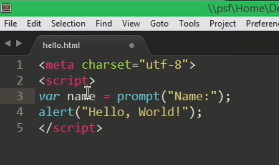
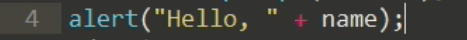
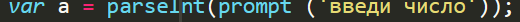

# WEB-development

## Практика студентов Финансового университета

# javaScript
__________________________________________

## Java Script. Переменные, типы данных

### [Методичка](https://docs.google.com/document/d/16WPr1DUWe6Bp80j_AT6WMD0nRo2yIQ7t/edit)

Цель работы

    Получить навыки работы с переменными, различными типами данных, операциями над ними.

### Задания для выполнения

Попросите пользователя ввести любое число и сохраните его в переменную.

Создайте калькулятор, который будет выполнять все арифметические операции над любыми введенными пользователем двумя числами.

Необходимо попросить  пользователя задумать число. Затем он должен  умножить это число  на 2 и прибавить к полученному результату 7. То, что вышло в итоге, нужно ввести в диалоговом окне prompt(). Вы должны выдать пользователю, какое число он задумал.

С помощью метода prompt() получите сначала имя пользователя, затем год его рождения и сохраните в 2 переменные. Вычислите возраст пользователя, и выведите его в абзаце с помощью document.write() в таком формате "Антон: 24".

Сохраните калькулятор и отправьте на GitHub в репозиторий Student, используя формат в названии Фамилия(латинскими буквами)_1.

### Методические указания

Для запоминания числа можно использовать команду prompt:

Чтобы запустить файл, необходимо запустить его в Google Chrome.

Проверить наличие ошибок можно с помощью нажатия трех точек в верхнем правом углу, затем – Дополнительные инструменты – Инструменты разработчика. В подсказке выдается номер строки, где содержится ошибка.

Вывести на экран значение переменной можно таким образом:

Для перевода в целочисленный тип из строки можно воспользоваться функцией parseInt.

### Контрольные вопросы
В чем разница между var и let?

Какие типы данных в Java Script вы знаете?

В каком типе сохраняется переменная, полученная с помощью команды prompt?

### Дополнительные задания

Выведите на экран тип используемой переменной.

 

### Дополнительные материалы
https://html-plus.in.ua/javascript-simple-tasks/

