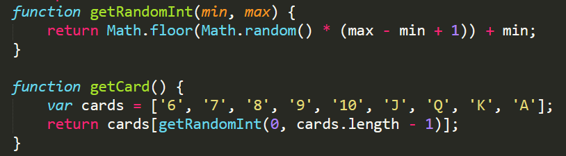
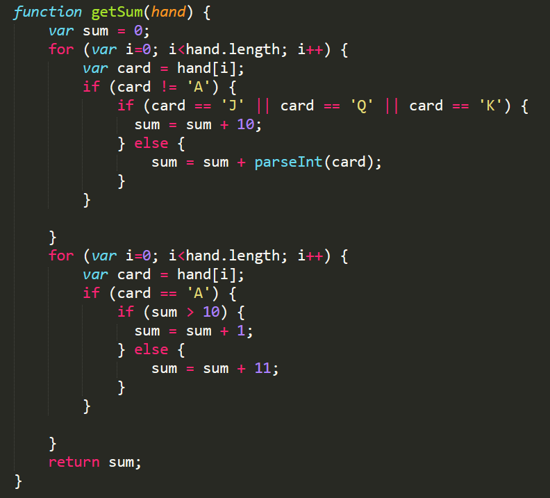
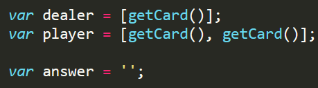
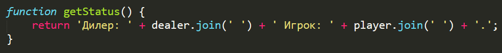
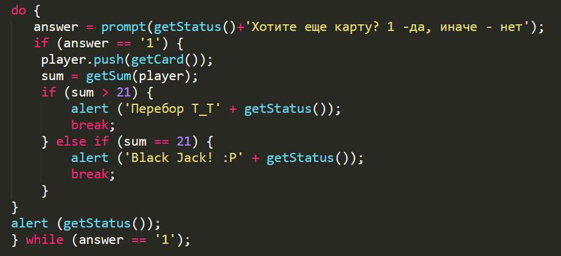
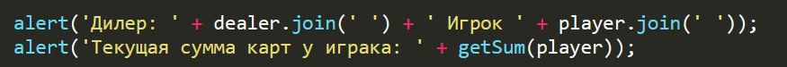

# WEB-development

## Практика студентов Финансового университета

# javaScript
__________________________________________

# Java Script. Игра Black Jack

### [Методичка](https://docs.google.com/document/d/1IkshSUprLN6kPMoTX4wv8Y_4PSweQluf/edit#)

## Цель работы

    Применить полученные навыки при создании алгоритма для игры в Black Jack.

## Задания для выполнения
1. Составить алгоритм игры в Black Jack и реализовать его на Java Script.
2. Загрузить созданную программы на GitHub в репозиторий Student, используя формат в названии Фамилия(латинскими буквами)_4.

## Методические указания
Блэкдже́к (англ. Blackjack «чёрный валет») — одна из самых популярных карточных игр в казино по всему миру. Большая популярность игры обуславливается простыми правилами, скоростью игры и наиболее простой стратегией в подсчёте карт. 

### Термины
*Игрок* - Играющий за столом против казино.

*Дилер (Крупье)* - Работник казино, выполняющий роль чесальщика колоды.

*Рука* - Набор карт игрока или дилера. Обычно правилами казино игрокам запрещается прикасаться к своим картам.

*Трекинг (Tracking)* - Отслеживание игроком расположения карт в процессе игры, с использованием этой информации на следующем шаффле.

*Шаффл (Shuffle)* - Полный «игровой цикл», начинающийся с замешивания колоды, и заканчивающийся выходом разрезной карты.

*Башмак, шуз (англ. shoe — ботинок)* - Специальное приспособление для карточных игр в казино. Колода перемешивается и вставляется в шуз, из которого потом идет раздача карт. 

*Фишка (англ. chip)* - Плоский небольшой предмет круглой, квадратной или восьмиугольной формы, на котором написан его номинал, может обмениваться на наличные деньги в кассе казино.

### Правила

Ошибочно считается, что цель заключается в том, чтобы набрать как можно больше очков, но не более 21. На самом деле цель — обыграть дилера (крупье). В игре используется от одной до восьми колод. Из-за того что вероятность комбинации блек-джек при большем числе колод ниже, то преимущество игрока уменьшается при увеличении числа колод. При игре с шаффл-машинкой считается, что используется бесконечная колода. По окончании партии, когда осталась примерно треть карт (точное значение устанавливает дилер, размещая специальную карточку в т. наз. «шуз» на глаз), колоды перемешиваются. При игре одной колодой чаще всего она перемешивается после каждой партии.

Значения очков каждой карты: от двойки до десятки — от 2 до 10 соответственно, у туза — 1 или 11 (11 пока общая сумма не больше 21, далее 1), у т. н. картинок (король, дама, валет) — 10.

Если у игрока и дилера число очков на руках равное, то такая ситуация называется «ровно»: за рубежом это называется — пуш (англ. push). В такой ситуации все остаются при своих ставках, никто не выигрывает и не проигрывает. Хотя в казино бывают исключения, и при «пуше» выигрывает казино.

Игроки до раздачи карт делают ставки, кладя фишки на соответствующие поля игрового стола. После того, как первая карта сдана, игрокам запрещается делать ставки и прикасаться к своим фишкам.

Дилер раздаёт карты (обычно из одной или двух колод карт, но чаще из шуза, содержащего не менее четырёх колод): по две карты каждому игроку, себе раздаёт одну карту (в США принято раздавать дилеру две карты, одна из которых открыта, а другая — закрыта, то есть находится на столе рубашкой вверх). Все карты открываются сразу (видны и дилеру, и игроку).

Если у игрока сразу после раздачи набралось 21 очко (то есть у игрока туз и десятиочковая карта), то такая ситуация и называется блек-джек. В таком случае игроку сразу выплачивается выигрыш 3 к 2 (то есть в 1,5 раза превышающий его ставку). Исключение составляют случаи, когда дилеру первой картой (открытой) попадается 10, картинка или туз. В этом случае существует вероятность, что у дилера также будет блек-джек, поэтому игроку с блек-джеком предлагается либо взять выигрыш 1 к 1 (только если первая карта дилера — туз), либо дождаться окончания конца игры (и в случае, если у дилера не блек-джек, получить выигрыш 3 к 2). 

Далее игрокам, у которых не блек-джек, предлагается на выбор либо взять ещё карту (в таком случае игрок должен сказать дилеру «карту» или «ещё», англ. hit me), либо остаться при тех картах (и той сумме очков), которые у него на руке (в этом случае игрок должен сказать дилеру «достаточно» или «хватит»). 

Как правило, если у игрока после взятия новой карты в сумме получается 21, дилер не спрашивает его больше и переходит к следующему игроку.

Если у игрока после взятия новой карты сумма очков превысит 21, то такая ситуация называется «перебор». Дилер произносит «много» и снимает ставку игрока в пользу казино.

Если у дилера в первых двух картах набирается 21 очко (блек-джек), то все игроки (кроме тех, у кого тоже блек-джек), проигрывают. Те, у которых блек-джек, остаются при своих ставках, если они ранее не выбрали взять выигрыш 1 к 1 или если не застраховали свою комбинацию от блек-джека.

В некоторых случаях, в зависимости от того, какие карты на руках у игрока, дилер может предложить ему дополнительные варианты (см. ниже).

После того, как все игроки завершили брать карты, дилер говорит «себе» и раздаёт карты себе. Общее правило блек-джека состоит в том, что дилер обязан остановиться, как только наберёт 17 очков или выше, и обязан брать, пока не достигнет (даже если у всех не перебравших меньше очков). В различных казино может варьироваться правило, должен ли дилер останавливаться в ситуации, если у него туз и шестёрка (то есть 7 или 17 очков на руке). Обычно это правило написано на игровом столе.

При окончательном подсчёте очков в конце раунда карты остальных игроков для вас значения не имеют, игра ведётся только против дилера, то есть сравниваются карты только игрока и дилера, карты и ставки параллельных игроков не учитываются.

### Контрольные вопросы
Что произойдет при обращении к функциям getRandomInt и getCard?
 

Что возвращают функция getSum?
 

Что хранится в переменных dealer, player, answer?
 

Что делает функция getStatus?
 

Что делает цикл do?
 

Что выведется на экран?
 

