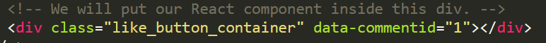

# WEB-development

## Практика студентов Финансового университета

# React

- # Добавить React на веб-сайт

Цель работы

    Получить навыки работы добавления React компонентов на html-сраницу.

## Задания для выполнения

Откройте HTML-страницу, которую вы хотите редактировать. Добавьте пустой тег ``
``, чтобы отметить место, где вы хотите что-либо отобразить с помощью React. Например:

    <!-- ... какой-то HTML ... -->

    

    
    <!-- ... какой-то HTML ... -->

2. Добавьте на страницу HTML три тега ``
        
        
        <!-- Загрузка нашего компонента React. -->
        
        
        </body>

3. Создайте файл с именем *like_button.js* рядом с вашей HTML-страницей. Возьмите стартовый код и вставьте его в созданный вами файл:

 
4. Добавьте несколько компонентов (кнопок) React на страницу и передайте им некоторые данные.
Например, так:

Загрузить созданную страницу на GitHub в репозиторий Student, используя формат в названии Фамилия (латинскими буквами)_1.
Методические указания
Чтобы новые кнопки отобразились, необходимо исправить html файл.

А также добавить в like_button.js c помощью Document метод querySelector()

## Контрольные вопросы
С какой целью создавался React?

## Дополнительные задания

Дополнительно: попробовать React с JSX

- # Метод render
Цель работы

    Познакомить с методом render, а также ReactDOM.

## Задания для выполнения

1. Перейдите по ссылке на сайте https://react.dev/learn/add-react-to-an-existing-project и ознакомьтесь с возможностями React на посадочной странице.

2. Откройте file [index.js](index.js) с уже со всеми подключенными необходимыми скриптами.

3. Выведите любое сообщение в какой-либо блок на вашем сайте с помощью Реакт.

4. Загрузить созданную страницу на GitHub в репозиторий Student, используя формат в названии Фамилия (латинскими буквами)_2.

## Методические указания
Чтобы вывести любое сообщение с помощью компонента Реакт, необходимо создать любой контейнер, например 
``
 
``
а затем поместить туда текст html. 
	

## Контрольные вопросы
Для чего нужен render?
## Дополнительные задания
Дополнительно: изменить html-текст.

- # Основы JSX
Цель работы

    Познакомить со способом описания визуального кода посредством комбинации кода на JavaScript и разметки XML.
## Задания для выполнения
1. Подключите библиотеки для работы с React.
2. В фигурных скобках JSX поместить любое корректное выражение JavaScript. Например, 5 + 2, user.firstName, или formatName(user) — всё это допустимые выражения в JavaScript.
3. Выведите свои ФИО, возраст и добавьте стилей с использованием формат JSX.
4. Загрузить созданную страницу на GitHub в репозиторий Student, используя формат в названии Фамилия (латинскими буквами)_3.

## Методические указания
1. Чтобы подключить вспомогательные библиотеки скопируйте ссылки:

        <!DOCTYPE html>
        <html>
        <head>
            <meta charset="utf-8" />
            <title>Hello React</title>
            
            
            
        </head>
        <body>
        …
        </body>
        </html> 
	
2. Чтобы создать и поместить объект можно воспользоваться синтаксисом: 

        <!--опишем объект-->
        
        <!--поместим описанный объект-->
        
 

3. Стили можно задать:

        const userClassName = "user-info";
        const styleObj = {
            color:'green', 
            fontFamily:'Verdana'
        };

Или ``inline: 
``

Для создания ФИО и возраст можно воспользоваться:

    const user = {
            id : 5,
            age: 33,
            firstName: 'Alevtina',
            lastName: 'Shatalova',
            getFullName: function(){ 
                return `${this.firstName} ${this.lastName}`;
            }
        };

Для сборки:

    ReactDOM.render(
        

                
Полное имя: {user.getFullName()}

                
Возраст: {user.age}

        
,
        document.getElementById("app")
    )

4. - При работе с JSX следует учитывать ряд моментов, в частности, в JSX для установки класса применяется атрибут *className*, а не class. 
    - Второй момент: атрибут *style* в качестве значения принимает объект javascript. 
    - И третий момент: в JSX используется camel-case, то есть если мы хотим определить стилевое свойство для шрифта, например, свойство font-family, то соответствующее свойство в объекте стиля будет называться *fontFamily*, то есть дефис отбрасывается, а следующая часть слова начинается с заглавной буквы.

## Контрольные вопросы
Чем JSX отличается от JS?
## Дополнительные задания
Дополнительно: изменить стиль реакт-компонентов и добавьте новые на html-страницу.

- # Компилятор Babel. Способы описания компонентов
Цель работы

    Познакомить со способами описания компонент в React, а также с компилятором для них Babel.
## Задания для выполнения
1. Подключите компилятор Babel  к html-странице. 
2. Определите один и тот же компонент тремя способами: функционально, используя классы ES6, с помощью стрелочной функции.
3. Поместите на страницу таймер с помощью компонента React.
4. Загрузить созданную страницу на GitHub в репозиторий Student, используя формат в названии Фамилия (латинскими буквами)_4.
## Методические указания
1. Чтобы подключить Babel:
В ``<head>`` укажите 

        

А также элемент *script*, который содержит основной код приложения, должен иметь атрибут type="text/babel":

        

2. Чтобы задать компонент функционально:

        function Hello() {
        return <h1>Привет</h1>;
        }

Чтобы задать компонент с помощью стрелочной функции:

    var Hello =() => {
        return (<h1>Привет</h1>);
    }
Чтобы задать компонент с помощью классов ES6:

    class Hello extends React.Component {
    render() {
        return <h1>Привет</h1>;
    }
    }
Также нужно задать метод render , который возвращает создаваемый элемент на JSX.

    ReactDOM.render(
                <Hello />,
                document.getElementById("container")
            )
3. Компонент с таймером:

        class Timer extends React.Component {
        constructor(props) {
            super(props);
            this.state = { seconds: 0 };
        }

        tick() {
            this.setState(state => ({
            seconds: state.seconds + 1
            }));
        }

        componentDidMount() {
            this.interval = setInterval(() => this.tick(), 1000);
        }

        componentWillUnmount() {
            clearInterval(this.interval);
        }

        render() {
            return (
            

                Seconds: {this.state.seconds}
            

            );
        }
        }

        ReactDOM.render(
        <Timer />,
        document.getElementById('timer-example')
        );

Примеры компонент представлены здесь:
https://reactjs.org/

## Контрольные вопросы
Зачем подключать Babel?

Что плохого в описании компонентов с использованием механизма классов?
## Дополнительные задания
Дополнительно: изменить стиль реакт-компонентов и добавьте новые на html-страницу.

# Ссылки:

  - title: "Лекция: Основы react.js" 
    overview: ""
    document:  # ссылка на методические указания
    youtube: # Видеозапись занятия
    slides: https://drive.google.com/open?id=1YknItmGxv1dYZlvSfWvCeF6T-4bFjHaJxKWvYOEqYaQ
    textbook: # ссылка на главу из учебника
    test: 
    additional: # ссылки на дополнительные материалы
      - title: "React JS Crash Course"
        url: https://www.youtube.com/watch?v=w7ejDZ8SWv8
      - title: "Официальный туториал"
        url: https://ru.reactjs.org/tutorial/tutorial.html
      - title: "Неофициальный туториал от Mozilla"
        url: https://developer.mozilla.org/ru/docs/Learn/Tools_and_testing/Client-side_JavaScript_frameworks/React_getting_started

  - title: "Практика: Hello World на react" 
    overview: ""
    document: https://docs.google.com/document/d/14tIkyWEhbBvuEqnmfUI5npykL4yNkkNj/edit?usp=sharing&ouid=116003821381017651142&rtpof=true&sd=true
    youtube: # Видеозапись занятия
    slides: 
    textbook: # ссылка на главу из учебника
    test: 

  - title: "Практика: Метод render()" 
    overview: ""
    document: https://docs.google.com/document/d/1rpi33BskSyUsYEWsOurOfT2UmI1Jl7CO/edit?usp=sharing&ouid=116003821381017651142&rtpof=true&sd=true
    youtube: # Видеозапись занятия
    slides: 
    textbook: # ссылка на главу из учебника
    test: 

  - title: "Практика: Основы JSX" 
    overview: ""
    document: https://docs.google.com/document/d/1hMSfnlGiltFJaIi4E65X0XDlp6iDNP5R/edit?usp=sharing&ouid=116003821381017651142&rtpof=true&sd=true
    youtube: # Видеозапись занятия
    slides: 
    textbook: # ссылка на главу из учебника
    test: 

  - title: "Практика: Компилятор babel" 
    overview: ""
    document: https://docs.google.com/document/d/1ABMBmofGiYXJYRmt3pIJLCm4nhvYr6eg/edit?usp=sharing&ouid=116003821381017651142&rtpof=true&sd=true
    youtube: # Видеозапись занятия
    slides: 
    textbook: # ссылка на главу из учебника
    test: 

  - title: "Практика: Сервер node.js" 
    overview: ""
    document: https://docs.google.com/document/d/1xp0kLSsXWkk8JhNPPcfMo1XhCTMbEf3z/edit?usp=sharing&ouid=116003821381017651142&rtpof=true&sd=true
    youtube: # Видеозапись занятия
    slides: 
    textbook: # ссылка на главу из учебника
    test: 

  - title: "Практика: Props, State и состояния" 
    overview: ""
    document: https://docs.google.com/document/d/1VvWtkQEMEIgLAYwABpGwQKx9kwR0lIxn/edit?usp=sharing&ouid=116003821381017651142&rtpof=true&sd=true
    youtube: # Видеозапись занятия
    slides: 
    textbook: # ссылка на главу из учебника
    test: 

  - title: "Практика: Жизненный цикл компонента" 
    overview: ""
    document: https://docs.google.com/document/d/1SgcCjH_EkROy80ZmIGaN3yQWlfdkdq85/edit?usp=sharing&ouid=116003821381017651142&rtpof=true&sd=true
    youtube: # Видеозапись занятия
    slides: 
    textbook: # ссылка на главу из учебника
    test: 

  - title: "Практика: Формы" 
    overview: ""
    document: https://docs.google.com/document/d/1UHlsEvnqPhD0inQdEaGrH9Z2vISrRwAM/edit?usp=sharing&ouid=116003821381017651142&rtpof=true&sd=true
    youtube: # Видеозапись занятия
    slides: 
    textbook: # ссылка на главу из учебника
    test: 

  - title: "Лекция: Продвинутый react.js. Хуки" 
    overview: ""
    document:  # ссылка на методические указания
    youtube: # Видеозапись занятия
    slides: 
    textbook: # ссылка на главу из учебника
    test: 
    additional: # ссылки на дополнительные материалы
      - title: "Introducing React Hooks"
        url: https://www.youtube.com/watch?v=mxK8b99iJTg
      - title: "React Hooks - Полный Курс (Про Все Хуки!)"
        url: https://www.youtube.com/watch?v=9KJxaFHotqI
      - title: "Введение в хуки"
        url: https://ru.reactjs.org/docs/hooks-intro.html
      - title: "Введение в React Hooks"
        url: https://habr.com/ru/post/429712/
      - title: "React Hooks"
        url: https://www.w3schools.com/react/react_hooks.asp

  - title: "Практика: Хуки" 
    overview: ""
    document: https://docs.google.com/document/d/1btq6_4bjdC6UXa488-Z7OpDaGx0GeLMq/edit?usp=sharing&ouid=116003821381017651142&rtpof=true&sd=true
    youtube: # Видеозапись занятия
    slides: 
    textbook: # ссылка на главу из учебника
    test: 

  - title: "Практика: Структура приложения React" 
    overview: ""
    document: https://docs.google.com/document/d/1zZzpWq-fo74oDt4VRbqFNF_Y4Ri3g9-E/edit?usp=sharing&ouid=116003821381017651142&rtpof=true&sd=true
    youtube: # Видеозапись занятия
    slides: 
    textbook: # ссылка на главу из учебника
    test: 

  - title: "Практика: Навигация и фильтрация в React" 
    overview: ""
    document: https://docs.google.com/document/d/1gFbJQg-T2gfX_48gHQY10aghjPi51T-B/edit?usp=sharing&ouid=116003821381017651142&rtpof=true&sd=true
    youtube: # Видеозапись занятия
    slides: 
    textbook: # ссылка на главу из учебника
    test: 

  - title: "Практика: Список дел" 
    overview: ""
    document: https://docs.google.com/document/d/17ZfCgeFReLKH00GVSRc3H9fIhO0Q_mHV/edit?usp=sharing&ouid=116003821381017651142&rtpof=true&sd=true
    youtube: # Видеозапись занятия
    slides: 
    textbook: # ссылка на главу из учебника
    test: 

  - title: "Практика: Условный рендер" 
    overview: ""
    document: https://docs.google.com/document/d/11MJ_e4lkOT2GNGWSeZ0B993Ssy_Qvy3p/edit?usp=sharing&ouid=116003821381017651142&rtpof=true&sd=true
    youtube: # Видеозапись занятия
    slides: 
    textbook: # ссылка на главу из учебника
    test: 

  - title: "Практика: Классовые компоненты" 
    overview: ""
    document: https://docs.google.com/document/d/1j5Tei-2ui8t3giYVZKMG4k_5iRqjL9MK/edit?usp=sharing&ouid=116003821381017651142&rtpof=true&sd=true
    youtube: # Видеозапись занятия
    slides: 
    textbook: # ссылка на главу из учебника
    test: 