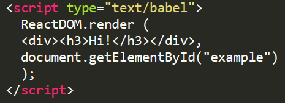

# WEB-development

## Практика студентов Финансового университета

# React
- [Добавить React на веб-сайт](#добавить-react-на-веб-сайт)
- [Метод render()](#метод-render) 
- [Основы JSX](#основы-jsx)
- [Props, State и состояния](#props-state-и-события)
- [Жизненный цикл компонента](#жизненный-цикл-управление-ресурсами-и-составные-компоненты)
- [Формы](#формы)
- # Добавить React на веб-сайт

Цель работы

    Получить навыки работы добавления React компонентов на html-сраницу.

## Задания для выполнения

Откройте HTML-страницу, которую вы хотите редактировать. Добавьте пустой тег ``
``, чтобы отметить место, где вы хотите что-либо отобразить с помощью React. Например:

    <!-- ... какой-то HTML ... -->

    

    
    <!-- ... какой-то HTML ... -->

2. Добавьте на страницу HTML три тега ``
        
        
        <!-- Загрузка нашего компонента React. -->
        
        
        </body>

3. Создайте файл с именем *like_button.js* рядом с вашей HTML-страницей. Возьмите стартовый код и вставьте его в созданный вами файл:

 
4. Добавьте несколько компонентов (кнопок) React на страницу и передайте им некоторые данные.
Например, так:

Загрузить созданную страницу на GitHub в репозиторий Student, используя формат в названии Фамилия (латинскими буквами)_1.
Методические указания
Чтобы новые кнопки отобразились, необходимо исправить html файл.

А также добавить в like_button.js c помощью Document метод querySelector()

## Контрольные вопросы
С какой целью создавался React?

## Дополнительные задания

Дополнительно: попробовать React с JSX

- # Метод render
Цель работы

    Познакомить с методом render, а также ReactDOM.

## Задания для выполнения

1. Перейдите по ссылке на сайте https://react.dev/learn/add-react-to-an-existing-project и ознакомьтесь с возможностями React на посадочной странице.

2. Откройте file [index.js](index.js) с уже со всеми подключенными необходимыми скриптами.

3. Выведите любое сообщение в какой-либо блок на вашем сайте с помощью Реакт.

4. Загрузить созданную страницу на GitHub в репозиторий Student, используя формат в названии Фамилия (латинскими буквами)_2.

## Методические указания
Чтобы вывести любое сообщение с помощью компонента Реакт, необходимо создать любой контейнер, например 
``
 
``
а затем поместить туда текст html. 
	

## Контрольные вопросы
Для чего нужен render?
## Дополнительные задания
Дополнительно: изменить html-текст.

- # Основы JSX
Цель работы

    Познакомить со способом описания визуального кода посредством комбинации кода на JavaScript и разметки XML.
## Задания для выполнения
1. Подключите библиотеки для работы с React.
2. В фигурных скобках JSX поместить любое корректное выражение JavaScript. Например, 5 + 2, user.firstName, или formatName(user) — всё это допустимые выражения в JavaScript.
3. Выведите свои ФИО, возраст и добавьте стилей с использованием формат JSX.
4. Загрузить созданную страницу на GitHub в репозиторий Student, используя формат в названии Фамилия (латинскими буквами)_3.

## Методические указания
1. Чтобы подключить вспомогательные библиотеки скопируйте ссылки:

        <!DOCTYPE html>
        <html>
        <head>
            <meta charset="utf-8" />
            <title>Hello React</title>
            
            
            
        </head>
        <body>
        …
        </body>
        </html> 
	
2. Чтобы создать и поместить объект можно воспользоваться синтаксисом: 

        <!--опишем объект-->
        
        <!--поместим описанный объект-->
        
 

3. Стили можно задать:

        const userClassName = "user-info";
        const styleObj = {
            color:'green', 
            fontFamily:'Verdana'
        };

Или ``inline: 
``

Для создания ФИО и возраст можно воспользоваться:

    const user = {
            id : 5,
            age: 33,
            firstName: 'Alevtina',
            lastName: 'Shatalova',
            getFullName: function(){ 
                return `${this.firstName} ${this.lastName}`;
            }
        };

Для сборки:

    ReactDOM.render(
        

                
Полное имя: {user.getFullName()}

                
Возраст: {user.age}

        
,
        document.getElementById("app")
    )

4. - При работе с JSX следует учитывать ряд моментов, в частности, в JSX для установки класса применяется атрибут *className*, а не class. 
    - Второй момент: атрибут *style* в качестве значения принимает объект javascript. 
    - И третий момент: в JSX используется camel-case, то есть если мы хотим определить стилевое свойство для шрифта, например, свойство font-family, то соответствующее свойство в объекте стиля будет называться *fontFamily*, то есть дефис отбрасывается, а следующая часть слова начинается с заглавной буквы.

## Контрольные вопросы
Чем JSX отличается от JS?
## Дополнительные задания
Дополнительно: изменить стиль реакт-компонентов и добавьте новые на html-страницу.

- # Props, State и события

Цель работы

    Познакомить с коллекциями значений, которые ассоциированы с компонентом. Эти значения позволяют создавать динамические компоненты, которые не зависят от жестко закодированных статических данных, а также учитывать состояние определенное внутри компонента и доступно только из компонента.

## Задания для выполнения
1. Выведите свои ФИО, возраст в одной переменной с помощью ``props``.
2. В конструкторе созданного класса установите объект ``state``. 
Создайте кнопку, которая будет менять состояние при нажатии с помощью компонента React. 
При определении конструктора компонента в нем должен вызываться конструктор базового класса, в который передается объект props.
3. Загрузить созданную страницу на GitHub в репозиторий Student, используя формат в названии Фамилия (латинскими буквами)_6.

## Методические указания

Для использования props можно воспользоваться синтаксисом на выбор:
*Функциональный подход*

    function Hello(props) {
      return 

                
Имя: {props.name}

                
Возраст: {props.age}

        
;
    }

*Использование классов ES6*

    class Hello extends React.Component {
      render() {
        return 

                
Имя: {this.props.name}

                
Возраст: {this.props.age}

        
;
      }
    }

*C использованием стрелочной функции:*

    const Hello = (props) => {
        
        const {name, age} = props;
        return(

                
Имя: {name}

                
Возраст: {age}

              
);
    }

А в конце использовать:

    ReactDOM.render(
                  <Hello name="Алевтина" age="33" />,
                  document.getElementById("app")
              )

Для обновления состояния вызывается функция

 ``setState(): this.setState({welcome: "Привет React"}``;

Вначале необходимо задать стиль для состояний:

    button{
                width: 100px;
                height:30px;
                border-radius: 4px;
                margin:50px;
            }
            .on{
                color:#666;
                background-color: #ccc;
            }
            .off{
                color:#888;
                background-color: white;
            }

А затем создать сам компонент изменяющий состояния:

        class ClickButton extends React.Component {
             
           constructor(props) {
               super(props);
               this.state = {class: "off", label: "Нажми"};
                 
               this.press = this.press.bind(this);
           }
           press(){
               let className = (this.state.class==="off")?"on":"off";
               this.setState({class: className});
           }
           render() {
               return <button onClick={this.press} className={this.state.class}>{this.state.label}</button>;
           }
       }
         
       ReactDOM.render(
           <ClickButton />,
           document.getElementById("app")
       )

И вызвать его в html-документе.
## Контрольные вопросы
В чем отличие Props от State?

В чем разница между обработкой событий в React и элементов DOM с помощью обычного JavaScript

## Дополнительные задания
Добавьте другие контролы к кнопке на страницу html.

- # Жизненный цикл, управление ресурсами и составные компоненты
Цель работы

    Познакомить с этапами жизненного цикла компонента, научить создавать составные компоненты и оптимизировать ресурсы приложения.

## Задания для выполнения
1. Реализуйте события жизненного цикла
 ``(constructor(props), componentWillMount(), render()``, а также после рендеринга
 ``shouldComponentUpdate(nextProps, nextState), componentWillUpdate(nextProps, nextState), render(), componentDidUpdate(prevProps, prevState))``
 для кнопки с помощью функций в React.

2. Создайте часы, которые выводят текущее время на страницу и для обновления времени используют таймер с помощью функции ``componentDidMount()``.
 А для освобождения ресурсов применяется функция ``componentWillUnmount()``.
3. Реализуйте поиск по списку с помощью составного компонента.
4. Загрузить созданную страницу на GitHub в репозиторий Student, используя формат в названии Фамилия (латинскими буквами)_7.

## Методические указания

1. Создание событий внутри ``class ClickButton`` extends   

        React.Component {:
                  constructor(props) {
                      super(props);
                      this.state = {class: "off", label: "Нажми"};
                        
                      this.press = this.press.bind(this);
                        
                      console.log("constructor");
                  }
                  componentWillReceiveProps(nextProps) {
                      console.log("componentWillReceiveProps()");
                  }

3. Список группы

        const propsValues = {
            title: "Список группы",
            items: [
                "Студент 1", 
                "Студент 2", 
                "Студент 3", 
                "Студент 4", 
                "Студент 5", 
                "Студент 6"
            ]
        };
              
        class Item extends React.Component {
            render() {
                return <li>{this.props.name}</li>;
            }
        }
                
        class SearchPlugin extends React.Component{
                    
            constructor(props){
                super(props);
                this.onTextChanged = this.onTextChanged.bind(this);
            }
                    
            onTextChanged(e){
                var text = e.target.value.trim();   // удаляем пробелы
                this.props.filter(text); // передаем введенный текст в родительский компонент
            }
                    
            render() {
                return <input placeholder="Поиск" onChange={this.onTextChanged} />;
            }
        }
                          
        class ItemsList extends React.Component {
            constructor(props){
                super(props);
                this.state = { items: this.props.data.items};
                                  
                this.filterList = this.filterList.bind(this);
            }
                    
            filterList(text){
                var filteredList = this.props.data.items.filter(function(item){
                    return item.toLowerCase().search(text.toLowerCase())!== -1;
                }); 
                this.setState({items: filteredList});
            }
                      
            render() {
                return(
                    
         
                        <h2>{this.props.data.title}</h2>
                        <SearchPlugin filter={this.filterList} />
                        <ul>
                            {
                                this.state.items.map(function(item){
                                    return <Item key={item} name={item} />
                                })
                            }
                        </ul>
                    
);
            }
        }
                  
        ReactDOM.render(
            <ItemsList data={propsValues} />,
            document.getElementById("app")
        )

## Контрольные вопросы
Что делает функция componentWillUnmount()?

Вызовется ли componentDidUpdate(prevProps, prevState) если shouldComponentUpdate возвращает false?

## Дополнительные задания
Оформить документы с помощью css.

- # Формы

Цель работы

    Познакомить с работой с формами в React.
## Задания для выполнения

1. В коде, где обновляется значение при вводе с помощью обработчика события change изменить способ получения введенных данных, с использованием атрибута ``ref``.

          <!DOCTYPE html>
          <html>
          <head>
              <meta charset="utf-8" />
              <title>Формы в React</title>
          </head>
          <body>
              

        
          
          
          
        
            
        </body>
        </html>

2. Загрузить созданную страницу на GitHub в репозиторий tera, используя формат в названии Фамилия (латинскими буквами)_8.
## Методические указания

Для обращения к компонентам у каждого установите атрибут ``ref``:

    <NameField value="" ref="nameField" />
    <AgeField value="5" ref="ageField" />

И в дальнейшем по значению атрибута мы можем ссылаться на эти компоненты, в том числе получать их состояние:

    handleSubmit(e) {
        e.preventDefault();
        var name = this.refs.nameField.state.value;
        var age = this.refs.ageField.state.value;
        if(this.refs.nameField.state.valid && this.refs.ageField.state.valid){
            alert("Имя: " + name + " Возраст: " + age);
        }
    }

## Контрольные вопросы
Атрибут ref может применяться к любому компоненту React?

Для чего служит атрибут defaultValue?

## Дополнительные задания
Добавьте стили на страницу html.

# Ссылки:

  - title: "Лекция: Основы react.js" 
    overview: ""
    document:  # ссылка на методические указания
    youtube: # Видеозапись занятия
    slides: https://drive.google.com/open?id=1YknItmGxv1dYZlvSfWvCeF6T-4bFjHaJxKWvYOEqYaQ
    textbook: # ссылка на главу из учебника
    test: 
    additional: # ссылки на дополнительные материалы
      - title: "React JS Crash Course"
        url: https://www.youtube.com/watch?v=w7ejDZ8SWv8
      - title: "Официальный туториал"
        url: https://ru.reactjs.org/tutorial/tutorial.html
      - title: "Неофициальный туториал от Mozilla"
        url: https://developer.mozilla.org/ru/docs/Learn/Tools_and_testing/Client-side_JavaScript_frameworks/React_getting_started

  - title: "Практика: Hello World на react" 
    overview: ""
    document: https://docs.google.com/document/d/14tIkyWEhbBvuEqnmfUI5npykL4yNkkNj/edit?usp=sharing&ouid=116003821381017651142&rtpof=true&sd=true
    youtube: # Видеозапись занятия
    slides: 
    textbook: # ссылка на главу из учебника
    test: 

  - title: "Практика: Метод render()" 
    overview: ""
    document: https://docs.google.com/document/d/1rpi33BskSyUsYEWsOurOfT2UmI1Jl7CO/edit?usp=sharing&ouid=116003821381017651142&rtpof=true&sd=true
    youtube: # Видеозапись занятия
    slides: 
    textbook: # ссылка на главу из учебника
    test: 

  - title: "Практика: Основы JSX" 
    overview: ""
    document: https://docs.google.com/document/d/1hMSfnlGiltFJaIi4E65X0XDlp6iDNP5R/edit?usp=sharing&ouid=116003821381017651142&rtpof=true&sd=true
    youtube: # Видеозапись занятия
    slides: 
    textbook: # ссылка на главу из учебника
    test: 

  - title: "Практика: Props, State и состояния" 
    overview: ""
    document: https://docs.google.com/document/d/1VvWtkQEMEIgLAYwABpGwQKx9kwR0lIxn/edit?usp=sharing&ouid=116003821381017651142&rtpof=true&sd=true
    youtube: # Видеозапись занятия
    slides: 
    textbook: # ссылка на главу из учебника
    test: 

  - title: "Практика: Жизненный цикл компонента" 
    overview: ""
    document: https://docs.google.com/document/d/1SgcCjH_EkROy80ZmIGaN3yQWlfdkdq85/edit?usp=sharing&ouid=116003821381017651142&rtpof=true&sd=true
    youtube: # Видеозапись занятия
    slides: 
    textbook: # ссылка на главу из учебника
    test: 

  - title: "Практика: Формы" 
    overview: ""
    document: https://docs.google.com/document/d/1UHlsEvnqPhD0inQdEaGrH9Z2vISrRwAM/edit?usp=sharing&ouid=116003821381017651142&rtpof=true&sd=true
    youtube: # Видеозапись занятия
    slides: 
    textbook: # ссылка на главу из учебника
    test: 
