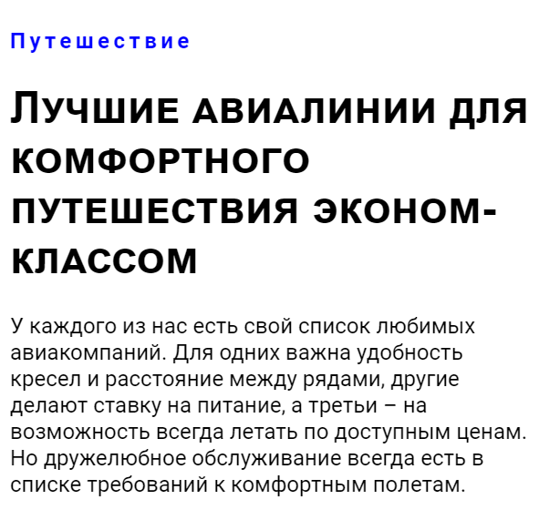
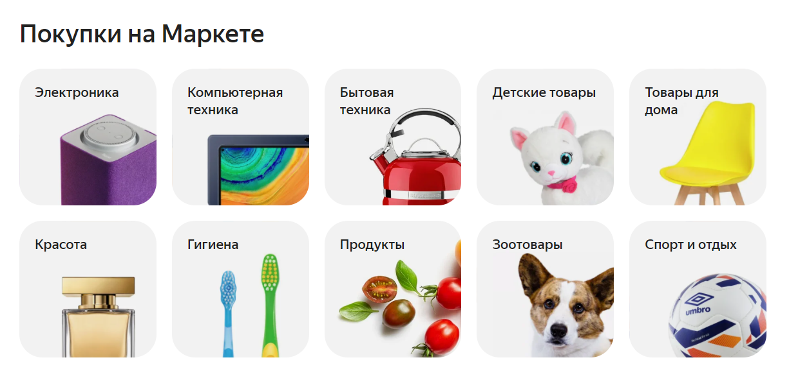
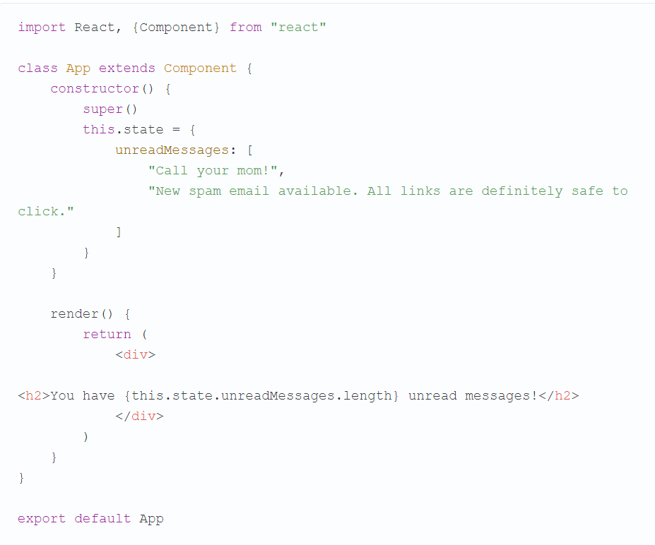
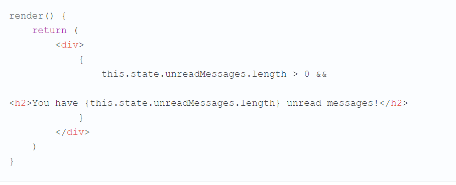
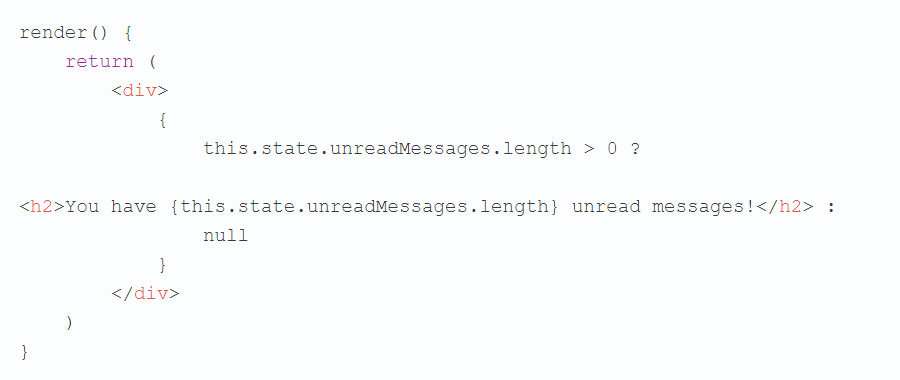
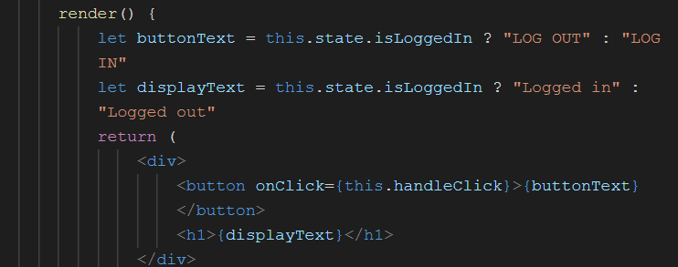
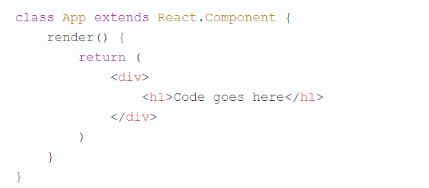
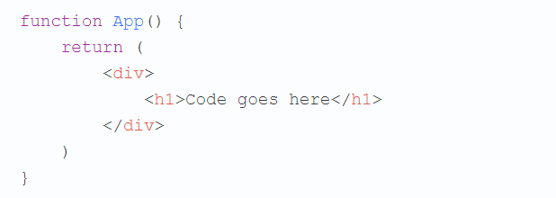
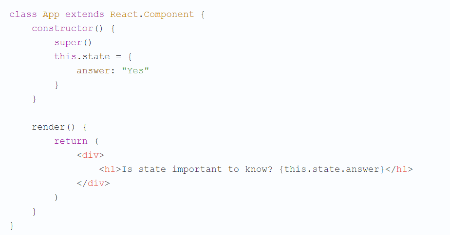

# WEB-development

## Практика студентов Финансового университета

# Продвинутый React

- # Хуки

Цель работы

    Познакомить с понятием Хуков и работой с ними в React.
## Задания для выполнения

1. Реализуйте функцию App со следующим синтаксисом:

        import "./styles.css";
        import React, { useState } from 'react';

        export default function App() {
        // Объявляем новую переменную состояния "count"
        const [count, setCount] = useState(0);

        return (
            

            
Вы нажали {count} раз

            <button onClick={() => setCount(count + 1)}>
                Нажми на меня
            </button>
            

        );
        }

В этом примере, ``useState`` — это хук. Мы вызываем его, чтобы наделить наш функциональный компонент внутренним состоянием. React будет хранить это состояние между рендерами. Вызов ``useState`` возвращает массив с двумя элементами, который содержит: текущее значение состояния и функцию для его обновления. Эту функцию можно использовать где угодно, например, в обработчике событий. Она схожа с ``this.setState`` в классах, но не сливает новое и старое состояние вместе.

 Хук состояния можно использовать в компоненте более одного раза.

// *Объявляем несколько переменных состояния!*

        const [age, setAge] = useState(42);
        const [fruit, setFruit] = useState('банан');
        const [todos, setTodos] = useState([{ text: 'Изучить хуки' }]);

2. Реализуйте для этих состояний функционал (кнопку), а также измените состояния.

3. Загрузить созданную страницу на GitHub в репозиторий tera, используя формат в названии Фамилия (латинскими буквами)_10.

## Методические указания
1. Хуки — нововведение в React 16.8, которое позволяет использовать состояние и другие возможности React без написания классов.

2. Хуки не меняют ваши знания о концепциях в React. Вместо этого, хуки предоставляют более прямой доступ к API уже знакомых вам понятий: пропсов, состояния, контекста, рефов, и жизненного цикла. Мы также рассмотрим мощный способ компоновать эти понятия с помощью хуков.
3. Хуки позволяют вам повторно использовать логику состояния, не затрагивая дерево компонентов. Также они позволяют разбить один компонент на маленькие функции по их назначению (например, подписке или загрузке данных).
4. Хуки НЕ работают внутри классов, а используются вместо них.

## Полезные ссылки
https://habr.com/ru/post/529950/

https://ru.reactjs.org/docs/hooks-overview.html

- # Структура приложения

Цель работы

    Познакомить со стандартной структурой приложения с использованием React-компонент.

## Задания для выполнения
1. Перейдите в редактор: https://codesandbox.io/s/new и в разделе Files ознакомьтесь со стандартной структурой проекта.
2. Измените содержание текста в файле App.js и его оформление в styles.css. Свойства текста можно брать здесь: https://schoolsw3.com/css/css_text.php

3. Создайте файлы App1.js, App2.js …, которые будут все вместе реализовывать верстку (поэкспериментируйте с кернингом, регистром и т.д.) (текст можно взять с сайта http://brightmagazine.ru/):

 

Проверить предложенное решение на читабельность можно с помощью: https://colorable.jxnblk.com/feffff/9cc2a5

4. Загрузить созданную страницу на GitHub в репозиторий tera, используя формат в названии Фамилия (латинскими буквами)_11.

## Методические указания

Чтобы приложение не выдавало ошибку, имена App нужно везде заменить на App1, App2… соответсвенно. Чтобы стили применились к созданным App необходимо указать их имена в ``styles.css``.

Для верстки можно использовать свойства:

    font-family: sans-serif;
    font-family: roboto;
    text-align: left;
    text-align: center;
    text-decoration: line-through;
    font-kerning: auto;
    font-kerning: normal;
    font-kerning: none;
    font-kerning: inherit;
    font-kerning: initial;
    font-variant-ligatures: normal;
    font-variant-ligatures: none;
    font-variant-ligatures: common-ligatures;           
    font-variant-ligatures: no-common-ligatures;       
    font-variant-ligatures: discretionary-ligatures;   
    font-variant-ligatures: no-discretionary-ligatures; 
    font-variant-ligatures: historical-ligatures;       
    font-variant-ligatures: no-historical-ligatures;   
    font-variant-ligatures: contextual;               
    font-variant-ligatures: no-contextual;             
    font-variant-ligatures: inherit;
    font-variant-ligatures: initial;
    font-variant: small-caps;

Подробно о каждом свойстве написано здесь: https://schoolsw3.com/css/css_text.php.

## Дополнительные задания:
Добавьте другие компоненты React, создайте для них функционал.

## Полезные материалы:
https://vc.ru/u/758273-nikita-osin/220656-struktura-react-rest-api-prilozheniya-typescript-styled-components

https://tproger.ru/translations/react-basic-weather-app/

https://ru.reactjs.org/docs/faq-structure.html

https://habr.com/ru/company/ruvds/blog/460793/

https://codesandbox.io/s/kind-bose-jo1t2?fontsize=14&hidenavigation=1&theme=dark

- # Фильтр для магазина

Цель работы

    Познакомить с реализацией структуры навигации и фильтрации в интерне-магазине с помощью React-компонент.

## Задания для выполнения
1. Перейдите в проект: https://jsfiddle.net/54yuaeLv/ и изучите его структуру.
2. Реализуйте аналогичную фильтрацию для своего проекта, добавив следующие изменения:
 
    - использовать стили
    - уберите обводки и поэкспериментируйте с цветом плашек (для примера берите реальные магазины)
    - увеличьте количество товаров до 20 (другие изображения, страны производитель, размер и т.д.)
    - добавьте фильтрацию по размеру XXL и стране производителю russia
    - добавить хедер и слайдер в верхнюю часть вашего интернет-магазина.

 

4. Загрузить созданную страницу на GitHub в репозиторий tera, используя формат в названии Фамилия (латинскими буквами)_12.

## Методические указания
Для реализации вашего проекта можно использовать любую песочницу, например https://reactjs.org/redirect-to-codepen/hello-world

Бутстрап можно подключить по инструкции: https://itchief.ru/bootstrap/installation

## Дополнительные задания:
Добавьте другие компоненты React (слайдеры, виджеты, карточки товаров, корзина и т.д.), создайте для них функционал.

- # Список дел

Цель работы

    Познакомить и получить навыки в реализации списка дел с помощью React-компонентов.
## Задания для выполнения
1. Реализуйте веб-приложение «Список дел» с помощью стандартного React-компонента:

        class TodoApp extends React.Component {
        constructor(props) {
            super(props);
            this.state = { items: [], text: '' };
            this.handleChange = this.handleChange.bind(this);
            this.handleSubmit = this.handleSubmit.bind(this);
        }

        render() {
            return (
            

                <h3>TODO</h3>
                <TodoList items={this.state.items} />
                <form onSubmit={this.handleSubmit}>
                <label htmlFor="new-todo">
                    What needs to be done?
                </label>
                <input
                    id="new-todo"
                    onChange={this.handleChange}
                    value={this.state.text}
                />
                <button>
                    Add #{this.state.items.length + 1}
                </button>
                </form>
            

            );
        }

        handleChange(e) {
            this.setState({ text: e.target.value });
        }

        handleSubmit(e) {
            e.preventDefault();
            if (this.state.text.length === 0) {
            return;
            }
            const newItem = {
            text: this.state.text,
            id: Date.now()
            };
            this.setState(state => ({
            items: state.items.concat(newItem),
            text: ''
            }));
        }
        }

        class TodoList extends React.Component {
        render() {
            return (
            <ul>
                {this.props.items.map(item => (
                <li key={item.id}>{item.text}</li>
                ))}
            </ul>
            );
        }
        }

        ReactDOM.render(
        <TodoApp />,
        document.getElementById('todos-example')
        );

## Техническое задание

1. Приложение должно содержать меню (более 4х элементов) – группировка дел по категориям (личные, работа, учеба, отдых и т.д.) с возможностью вести список в каждом из категорий.
Оформление страниц не должно включать шрифты с засечками и нечитабельные цветовые сочетания.
Каждая категория должна сопровождаться пиктограммой.
Пример для реализации: 

 

2. Загрузить созданную страницу на GitHub в репозиторий tera, используя формат в названии Фамилия (латинскими буквами)_13.

## Методические указания
Для реализации вашего проекта можно использовать любую структуру проекта. Например, реализацию внутри html-страницы:

    <!DOCTYPE html>
    <html>
    <head>
        <meta charset="utf-8" />
        <title>Hello React</title>
    </head>
    <body>
        

        
        
        
        <script type="text/babel">
    ….

Бутстрап можно подключить по инструкции: https://itchief.ru/bootstrap/installation

Сочетание читабельных цветосочетаний можно проверить здесь:
https://colorable.jxnblk.com/feffff/9cc2a5

Код пиктограмм можно взять здесь:
http://konstantinbulgakov.com/tools/icons

## Дополнительные задания:
Добавьте другие компоненты React (слайдеры, виджеты, карточки дел, анимацию и т.д.), создайте для них функционал.

- # Условный рендер

Цель работы

    Познакомить и получить навыки в реализации условного рендера.

## Задания для выполнения
1. На сегодняшнем занятии по условному рендерингу мы поговорим об использовании логического оператора ``&&`` (И). Экспериментировать будем со стандартным проектом, созданным средствами ``create-react-app``, в файле App.js которого находится следующий код:

 

Возможно, вы уже пользовались оператором && в конструкциях наподобие ``true && false`` (что даёт false). 

Для того, чтобы в результате вычисления подобного выражения было бы возвращено true, оно должно выглядеть как ``true && true``. 
При обработке таких выражений JavaScript определяет, является ли их левая часть истинной, и, если это так, просто возвращает то, что находится в их правой части. Если обрабатывается выражение вида ``false && false``, то сразу будет возвращено false, без проверки правой части выражения. В результате оператор && можно использовать в условном рендеринге. С его помощью можно либо вернуть что-то, что будет выведено на экран, либо не возвращать ничего.

Проанализируем код учебного приложения.

В состоянии компонента App хранится массив строк unreadMessages. 
Каждая строка в этом массиве представляет собой непрочитанное сообщение. На страницу выводится количество непрочитанных сообщений, определяемое на основе длины массива. 
Если же этот массив будет пустым, то есть в нём не будет ни одного элемента, то приложение выведет на страницу 0.
Для того чтобы добиться такого эффекта, достаточно привести массив к такому виду: ``unreadMessages: []``.

Если непрочитанных сообщений нет, то вполне можно не выводить вообще никакого сообщения. Если воспользоваться для реализации такого поведения приложения тернарным оператором, о котором мы говорили в прошлый раз, метод ``render()`` компонента App можно переписать так:

 

Теперь в том случае, если массив unreadMessages пуст, на страницу не будет выводиться ничего. Но представленный здесь код можно упростить благодаря использованию оператора &&. Вот как это будет выглядеть:

 

## Техническое задание
1.  1. Добавьте на страницу, которую формирует компонент, кнопку, которая позволяет пользователю входить в систему и выходить из неё.
    2. Сделайте так, чтобы, если пользователь не вошёл в систему, на кнопке выводилась бы надпись LOG IN, а если вошёл — надпись LOG OUT.
    3. Выведите на странице, формируемой компонентом, надпись Logged in в том случае, если пользователь вошёл в систему, и Logged out в том случае, если не вошёл.
    4. Добавьте остальные компоненты формы.

2. Загрузить созданную страницу на GitHub в репозиторий tera, используя формат в названии Фамилия (латинскими буквами)_14.

## Методические указания
Чтобы выводить на страницу текст, зависящий от того, вошёл пользователь в систему или нет, можно воспользоваться кодом:

 

## Дополнительные задания:
Добавьте другие компоненты React на страницу.
## Полезные ссылки:
https://scrimba.com/scrim/c893vh2?pl=p7P5Hd

https://habr.com/ru/company/ruvds/blog/443210/

- # Компоненты, основанные на классах

Цель работы

    Получить навыки работы с классами.

## Задания для выполнения
1. Перепишите код любого (кроме первого) компонента на сайте https://reactjs.org/ через функцию: 

 

2.  Перепишите код, используя класс

3. Загрузить созданную страницу на GitHub в репозиторий tera, используя формат в названии Фамилия (латинскими буквами)_15.

## Методические указания

1. Как вы уже знаете, в React мы можем задавать компоненты как функции или как классы.
Сейчас актуально направление, в соответствии с которым везде, где это возможно, используют функциональные компоненты, а компоненты, основанные на классах — лишь там, где они действительно необходимы. При этом надо отметить, что всё это — лишь рекомендации. Каждый разработчик сам решает как именно он будет конструировать свои приложения.

2. Классы в JavaScript представляют собой надстройку над традиционной моделью прототипного наследования. Сущность конструкции ``class App extends React.Component`` сводится к тому, что мы объявляем новый класс и указываем на то, что его прототипом должен быть ``React.Component``. Наличие у нашего компонента этого прототипа позволяет пользоваться в этом компоненте всеми теми полезными возможностями, которые имеются в ``React.Component``.
3. У компонента, основанного на классах, должен быть, по меньшей мере, один метод. Это — метод ``render()``. Данный метод должен возвращать то же самое, что мы обычно возвращаем из функциональных компонентов.
Сравните этот код:

 

И этот:

 

Если, перед формированием элементов, возвращаемых этим методом, нужно выполнить некие вычисления, их выполняют именно в этом методе, перед командой ``return``. То есть, если у вас есть некий код, определяющий порядок формирования визуального представления компонента, этот код нужно поместить в метод ``render``.

Если некоему компоненту нужно работать с состоянием, то это должен быть компонент, основанный на классе.  Eсли попытаться, в компоненте, основанном на классе, использовать конструкцию наподобие ``this.props.name = "NoName"`` — мы столкнёмся с сообщением об ошибке.

 

4. Компонент выводит на экран вопрос Is state important to know? В состоянии хранится ответ на этот вопрос. Для того чтобы добавить этот ответ после вопроса, нужно поступить так же, как мы обычно поступаем, добавляя JavaScript-конструкции в JSX-код. А именно, надо добавить в конец строки конструкцию ``{this.state.answer}``.
## Вопросы для закрепления:
1. Чем класс отличается от функции?
2. Может ли класс не содержать ни одного из методов?
3. Можно ли в компоненте, основанном на классе, использовать конструкцию наподобие ``this.props.name = "NoName"``?

## Дополнительные задания:
Перепишите все компоненты через функцию.
## Полезные ссылки:
https://habr.com/ru/company/ruvds/blog/438986/

# Ссылки:

 
  - title: "Лекция: Продвинутый react.js. Хуки" 
    overview: ""
    document:  # ссылка на методические указания
    youtube: # Видеозапись занятия
    slides: 
    textbook: # ссылка на главу из учебника
    test: 
    additional: # ссылки на дополнительные материалы
      - title: "Introducing React Hooks"
        url: https://www.youtube.com/watch?v=mxK8b99iJTg
      - title: "React Hooks - Полный Курс (Про Все Хуки!)"
        url: https://www.youtube.com/watch?v=9KJxaFHotqI
      - title: "Введение в хуки"
        url: https://ru.reactjs.org/docs/hooks-intro.html
      - title: "Введение в React Hooks"
        url: https://habr.com/ru/post/429712/
      - title: "React Hooks"
        url: https://www.w3schools.com/react/react_hooks.asp

  - title: "Практика: Хуки" 
    overview: ""
    document: https://docs.google.com/document/d/1btq6_4bjdC6UXa488-Z7OpDaGx0GeLMq/edit?usp=sharing&ouid=116003821381017651142&rtpof=true&sd=true
    youtube: # Видеозапись занятия
    slides: 
    textbook: # ссылка на главу из учебника
    test: 

  - title: "Практика: Структура приложения React" 
    overview: ""
    document: https://docs.google.com/document/d/1zZzpWq-fo74oDt4VRbqFNF_Y4Ri3g9-E/edit?usp=sharing&ouid=116003821381017651142&rtpof=true&sd=true
    youtube: # Видеозапись занятия
    slides: 
    textbook: # ссылка на главу из учебника
    test: 

  - title: "Практика: Навигация и фильтрация в React" 
    overview: ""
    document: https://docs.google.com/document/d/1gFbJQg-T2gfX_48gHQY10aghjPi51T-B/edit?usp=sharing&ouid=116003821381017651142&rtpof=true&sd=true
    youtube: # Видеозапись занятия
    slides: 
    textbook: # ссылка на главу из учебника
    test: 

  - title: "Практика: Список дел" 
    overview: ""
    document: https://docs.google.com/document/d/17ZfCgeFReLKH00GVSRc3H9fIhO0Q_mHV/edit?usp=sharing&ouid=116003821381017651142&rtpof=true&sd=true
    youtube: # Видеозапись занятия
    slides: 
    textbook: # ссылка на главу из учебника
    test: 

  - title: "Практика: Условный рендер" 
    overview: ""
    document: https://docs.google.com/document/d/11MJ_e4lkOT2GNGWSeZ0B993Ssy_Qvy3p/edit?usp=sharing&ouid=116003821381017651142&rtpof=true&sd=true
    youtube: # Видеозапись занятия
    slides: 
    textbook: # ссылка на главу из учебника
    test: 

  - title: "Практика: Классовые компоненты" 
    overview: ""
    document: https://docs.google.com/document/d/1j5Tei-2ui8t3giYVZKMG4k_5iRqjL9MK/edit?usp=sharing&ouid=116003821381017651142&rtpof=true&sd=true
    youtube: # Видеозапись занятия
    slides: 
    textbook: # ссылка на главу из учебника
    test: 